# Deployment Guide - E-Commerce Fraud Detector

This guide covers deploying the E-Commerce Fraud Detector to various platforms:
- [Self-Hosted Production](#self-hosted-production-deployment) - **Full control** (Nginx + SSL + Cloudflare)
- [CI/CD Pipeline](#cicd-pipeline) - Automated build and deploy
- [Vercel](#vercel-deployment) - Frontend only (serverless)
- [Railway](#railway-deployment) - Full-stack (managed PostgreSQL)
- [Docker](#docker-deployment) - Local/self-hosted
- [Minikube](#minikube-deployment) - Local Kubernetes cluster

---

## Self-Hosted Production Deployment

> [!TIP]
> This is the recommended approach if you want **full control** over your infrastructure, similar to what Render or Railway provides, but on your own Linux server.

### Architecture Overview

```mermaid
graph TB
    subgraph "Internet"
        User[👤 User]
    end
    
    subgraph "Edge Access Options"
        CF[Cloudflare Tunnel]
        DNS[DuckDNS + Let's Encrypt]
    end
    
    subgraph "Linux Server"
        UFW[🔥 UFW Firewall<br/>Ports: 80, 443]
        
        subgraph "Docker Network"
            NGINX[🌐 Nginx<br/>Reverse Proxy + SSL]
            API[⚙️ Flask API<br/>Port 8000]
            FE[🎨 React Frontend<br/>Port 80]
            DB[(🐘 PostgreSQL<br/>Port 5432)]
            REDIS[(📦 Redis Cache)]
        end
    end
    
    User --> CF
    User --> DNS
    CF --> UFW
    DNS --> UFW
    UFW --> NGINX
    NGINX --> FE
    NGINX --> API
    API --> DB
    API --> REDIS
    
    style NGINX fill:#4CAF50
    style API fill:#2196F3
    style DB fill:#FF9800
```



### Prerequisites

- Linux server (Ubuntu 22.04+ recommended)
- Domain name OR DuckDNS subdomain (free)
- SSH access to server
- Git installed

---

### Phase 1: Server Preparation & UFW Firewall

```bash
# Update system
sudo apt update && sudo apt upgrade -y

# Install essentials
sudo apt install -y git curl ufw

# Configure UFW firewall
sudo ufw default deny incoming
sudo ufw default allow outgoing
sudo ufw allow OpenSSH
sudo ufw allow 80/tcp
sudo ufw allow 443/tcp
sudo ufw enable

# Verify
sudo ufw status
```

> [!IMPORTANT]
> Only ports 22 (SSH), 80 (HTTP), and 443 (HTTPS) should be open. Database and Redis are internal only.

---

### Phase 2: Install Docker

```bash
# Install Docker
curl -fsSL https://get.docker.com | sudo sh

# Add user to docker group
sudo usermod -aG docker $USER

# Log out and back in, then verify
exit
# SSH back in
docker --version
docker compose version
```

---

### Phase 3: Clone & Configure

```bash
# Clone repository
git clone https://github.com/YOUR_USERNAME/E-Commerce_Fraud_Detector.git
cd E-Commerce_Fraud_Detector

# Create production environment file
cp .env.production.example .env

# Generate secure secrets
echo "JWT_SECRET=$(openssl rand -base64 32)"
echo "ADMIN_SECRET=$(openssl rand -base64 32)"
echo "API_TOKEN=$(openssl rand -base64 32)"
echo "POSTGRES_PASSWORD=$(openssl rand -base64 16)"

# Edit .env with generated values
nano .env
```

---

### Phase 4: Setup DuckDNS (Free Domain)

1. Go to [duckdns.org](https://www.duckdns.org) and login
2. Create subdomain: `fraud-detector.duckdns.org`
3. Configure auto-update:

```bash
# Edit the DuckDNS script
nano infra/duckdns/duck.sh

# Update SUBDOMAIN and TOKEN values
# Make executable
chmod 700 infra/duckdns/duck.sh

# Test
./infra/duckdns/duck.sh
cat ~/duckdns/duck.log

# Add to cron (every 5 minutes)
crontab -e
# Add: */5 * * * * ~/E-Commerce_Fraud_Detector/infra/duckdns/duck.sh >/dev/null 2>&1
```

See [infra/duckdns/README.md](infra/duckdns/README.md) for detailed setup.

---

### Phase 5: Get SSL Certificate (Let's Encrypt)

```bash
# Install Certbot
sudo apt install certbot -y

# Get certificate (standalone mode - stop any web servers first)
sudo certbot certonly --standalone -d fraud-detector.duckdns.org

# Verify certificate
sudo ls -la /etc/letsencrypt/live/fraud-detector.duckdns.org/

# Update Nginx config with your domain
nano infra/nginx/default.conf
# Replace YOUR_DOMAIN with fraud-detector.duckdns.org

# Test auto-renewal
sudo certbot renew --dry-run
```

---

### Phase 6: Deploy with Docker Compose

```bash
cd infra/compose

# Build and start all services
docker compose -f docker-compose.prod.yml up -d --build

# Check status
docker compose ps

# View logs
docker compose logs -f nginx
docker compose logs -f api
```

**Verify deployment:**
```bash
# Health check
curl -k https://localhost/health

# Or with your domain
curl https://fraud-detector.duckdns.org/health
```

---

### Phase 7: Cloudflare Tunnel (Optional - Zero Trust Access)

> [!NOTE]
> Use Cloudflare Tunnel for zero exposed ports. Great for home servers or extra security.

```bash
# Install cloudflared
curl -L https://github.com/cloudflare/cloudflared/releases/latest/download/cloudflared-linux-amd64 -o cloudflared
chmod +x cloudflared
sudo mv cloudflared /usr/local/bin/

# Login (opens browser)
cloudflared tunnel login

# Create tunnel
cloudflared tunnel create fraud-detector
# Note your TUNNEL_ID from output

# Configure - edit infra/cloudflared/config.yml
# Update YOUR_TUNNEL_ID and YOUR_USER

# Route DNS in Cloudflare dashboard
cloudflared tunnel route dns fraud-detector fraud-detector.yourdomain.com

# Install as system service
sudo cloudflared --config /path/to/config.yml service install
sudo systemctl enable --now cloudflared
```

---

### Access Your Application

| Method | URL | Use Case |
|--------|-----|----------|
| **DuckDNS + Let's Encrypt** | `https://fraud-detector.duckdns.org` | Free, self-managed |
| **Cloudflare Tunnel** | `https://fraud-detector.yourdomain.com` | Zero exposed ports |

---

### Useful Commands Reference

```bash
# View containers
docker compose -f docker-compose.prod.yml ps

# View logs
docker compose -f docker-compose.prod.yml logs -f api

# Rebuild after changes
docker compose -f docker-compose.prod.yml up -d --build

# Database backup
docker compose exec db pg_dump -U postgres frauddb > backup_$(date +%Y%m%d).sql

# Check Nginx config
docker compose exec nginx nginx -t
```

---

### Security Checklist

- [ ] UFW enabled with only ports 22, 80, 443
- [ ] Strong passwords in `.env` (use generated secrets)
- [ ] SSL certificate installed and auto-renewal tested
- [ ] Database port (5432) not exposed externally
- [ ] Redis password set
- [ ] Regular backups configured

---


## CI/CD Pipeline

### Overview
The project includes automated CI/CD pipelines using GitHub Actions. Pipelines are triggered on push and pull requests.

### Workflows

| Workflow | File | Trigger | Purpose |
|----------|------|---------|---------|
| **CI/CD Pipeline** | `ci-cd.yml` | Push/PR to main, develop | Full pipeline: lint, test, build, deploy |
| **Docker Publish** | `docker-publish.yml` | Push to main, tags | Multi-platform Docker images |
| **K8s Deploy** | `k8s-deploy.yml` | Manual | Kubernetes deployment with environment selection |

### Pipeline Jobs


### Required GitHub Secrets

Configure these in **Settings → Secrets and variables → Actions**:

| Secret | Required | Description |
|--------|----------|-------------|
| `GITHUB_TOKEN` | Auto | Automatic, used for GHCR |
| `DOCKERHUB_USERNAME` | Optional | Docker Hub username |
| `DOCKERHUB_TOKEN` | Optional | Docker Hub access token |
| `KUBE_CONFIG` | For K8s | Base64 encoded kubeconfig |

### Triggering Deployments

**Automatic:**
- Push to `develop` → Deploy to staging
- Push to `main` → Deploy to production

**Manual K8s Deploy:**
1. Go to **Actions** → **Kubernetes Deploy**
2. Click **Run workflow**
3. Select environment (staging/production)
4. Enter image tag (default: latest)

---

## Prerequisites

## Vercel Deployment

### Overview
Deploy the React frontend to Vercel's edge network for optimal performance.

> [!NOTE]  
> Vercel deployment is for the **frontend only**. You'll need a separate backend deployment (Railway, Render, or self-hosted).

### Step 1: Install Vercel CLI

```powershell
npm install -g vercel
```

### Step 2: Configure Environment Variables

Create or update `frontend/.env.production`:

```env
VITE_API_URL=https://your-backend-url.railway.app
```

### Step 3: Deploy to Vercel

```powershell
cd frontend
vercel
```

Follow the prompts:
1. Set up and deploy? **Yes**
2. Which scope? Select your account
3. Link to existing project? **No** (first time)
4. Project name? `fraud-detector-frontend`
5. In which directory is your code located? `./`
6. Override settings? **No**

### Step 4: Set Environment Variables in Vercel Dashboard

1. Go to [vercel.com/dashboard](https://vercel.com/dashboard)
2. Select your project → Settings → Environment Variables
3. Add:
   - `VITE_API_URL` = Your backend API URL

### Step 5: Production Deployment

```powershell
vercel --prod
```

### Vercel Configuration File

The project includes `frontend/vercel.json` for SPA routing:

```json
{
  "rewrites": [
    { "source": "/(.*)", "destination": "/index.html" }
  ]
}
```

---

## Railway Deployment

### Overview
Deploy the complete stack (frontend + backend + PostgreSQL) to Railway.

### Step 1: Create Railway Account

1. Go to [railway.app](https://railway.app)
2. Sign up with GitHub

### Step 2: Create New Project

1. Click **New Project** → **Deploy from GitHub repo**
2. Select your `E-Commerce_Fraud_Detector` repository
3. Railway will detect the monorepo structure

### Step 3: Add PostgreSQL Database

1. In your project, click **Add Service** → **Database** → **PostgreSQL**
2. Copy the `DATABASE_URL` from the PostgreSQL service Variables tab

### Step 4: Configure Backend Service

1. Click **Add Service** → **GitHub Repo** → Select your repo
2. Configure settings:
   - **Root Directory**: `backend`
   - **Build Command**: `pip install -r requirements.txt`
   - **Start Command**: `gunicorn --config gunicorn.conf.py app:app`

3. Add Environment Variables:
   ```
   DATABASE_URL=${{Postgres.DATABASE_URL}}
   FLASK_ENV=production
   JWT_SECRET=<generate-secure-key>
   ADMIN_SECRET=<generate-secure-key>
   API_TOKEN=<generate-secure-key>
   REVIEW_THR=0.65
   TX_THR=0.50
   ```

### Step 5: Configure Frontend Service

1. Click **Add Service** → **GitHub Repo** → Select your repo
2. Configure settings:
   - **Root Directory**: `frontend`
   - **Build Command**: `npm ci && npm run build`
   - **Start Command**: Leave empty (static files served by Railway)

3. Add Environment Variables:
   ```
   VITE_API_URL=${{Backend.RAILWAY_PUBLIC_DOMAIN}}
   ```

### Step 6: Generate Domain

1. Click on each service → **Settings** → **Networking**
2. Click **Generate Domain**
3. Note your URLs:
   - Backend: `https://fraud-detector-backend-xxxx.railway.app`
   - Frontend: `https://fraud-detector-frontend-xxxx.railway.app`

### Railway Configuration Files

**backend/railway.toml:**
```toml
[build]
builder = "nixpacks"

[deploy]
startCommand = "gunicorn --config gunicorn.conf.py app:app"
healthcheckPath = "/health"
healthcheckTimeout = 180
restartPolicyType = "on_failure"
restartPolicyMaxRetries = 3
```

---

## Docker Deployment

### Overview
Deploy using Docker Compose for local development or self-hosted production.

### Prerequisites

- Docker Desktop installed
- Docker Compose v2+

### Step 1: Development Deployment

```powershell
# From project root
cd infra/compose

# Start all services
docker-compose up -d

# View logs
docker-compose logs -f
```

**Services started:**
| Service | URL | Description |
|---------|-----|-------------|
| Frontend | http://localhost:3000 | React UI |
| Backend API | http://localhost:8000 | Flask API |
| PostgreSQL | localhost:5432 | Database |
| Adminer | http://localhost:8080 | DB admin UI |
| Redis | localhost:6379 | Cache (optional) |

### Step 2: Production Deployment

Use the production compose file:

```powershell
docker-compose -f docker-compose.prod.yml up -d
```

### Step 3: Build Individual Images

**Backend:**
```powershell
cd backend
docker build -t fraud-detector-api:latest .
```

**Frontend:**
```powershell
cd frontend
docker build -t fraud-detector-ui:latest .
```

### Step 4: Push to Registry (Optional)

```powershell
# Tag for Docker Hub
docker tag fraud-detector-api:latest yourusername/fraud-detector-api:latest
docker tag fraud-detector-ui:latest yourusername/fraud-detector-ui:latest

# Push
docker push yourusername/fraud-detector-api:latest
docker push yourusername/fraud-detector-ui:latest
```

### Step 5: Environment Configuration

Create `.env` file in project root (see `.env.production.example`):

```env
# Database
DATABASE_URL=postgresql+psycopg2://postgres:postgres@db:5432/frauddb

# Secrets (CHANGE THESE!)
JWT_SECRET=your-32-char-secret
ADMIN_SECRET=your-32-char-secret
API_TOKEN=your-32-char-secret

# Thresholds
REVIEW_THR=0.65
TX_THR=0.50
```

### Docker Commands Reference

```powershell
# Start services
docker-compose up -d

# Stop services
docker-compose down

# Stop and remove volumes (DELETES DATA!)
docker-compose down -v

# Rebuild after code changes
docker-compose up -d --build

# View specific service logs
docker-compose logs -f api

# Execute command in running container
docker-compose exec api python -c "print('Hello from API')"

# Check service status
docker-compose ps
```

---

## Minikube Deployment

### Overview
Deploy to a local Kubernetes cluster using Minikube for testing Kubernetes deployments.

### Prerequisites

- Minikube installed ([Installation Guide](https://minikube.sigs.k8s.io/docs/start/))
- kubectl installed
- Docker Desktop (for building images)

### Step 1: Start Minikube

```powershell
# Start with sufficient resources
minikube start --cpus=4 --memory=8192 --driver=docker

# Enable required addons
minikube addons enable ingress
minikube addons enable metrics-server
```

### Step 2: Build Images in Minikube's Docker

```powershell
# Point shell to Minikube's Docker daemon
minikube docker-env | Invoke-Expression

# Build images
docker build -t fraud-detector-api:latest ./backend
docker build -t fraud-detector-ui:latest ./frontend
```

### Step 3: Apply Kubernetes Manifests

```powershell
# Create namespace
kubectl apply -f infra/k8s/namespace.yaml

# Apply all resources
kubectl apply -f infra/k8s/

# Or use Kustomize
kubectl apply -k infra/k8s/
```

### Step 4: Verify Deployment

```powershell
# Check all resources
kubectl get all -n fraud-detector

# Check pods
kubectl get pods -n fraud-detector

# Check services
kubectl get svc -n fraud-detector

# Check ingress
kubectl get ingress -n fraud-detector
```

### Step 5: Access the Application

```powershell
# Get Minikube IP
minikube ip

# Access frontend (add to hosts file for domain)
# Or use port-forward
kubectl port-forward svc/frontend -n fraud-detector 3000:80

# Access backend
kubectl port-forward svc/backend -n fraud-detector 8000:8000
```

### Step 6: Add to Hosts File (Optional)

For domain-based access:

```powershell
# Get Minikube IP
$minikubeIP = minikube ip

# Add to hosts file (run as Administrator)
Add-Content -Path C:\Windows\System32\drivers\etc\hosts -Value "$minikubeIP fraud-detector.local"
```

Access at: `http://fraud-detector.local`

### Kubernetes Files Structure

```
infra/k8s/
├── namespace.yaml         # Namespace definition
├── configmap.yaml         # Environment configuration
├── secrets.yaml           # Sensitive data (base64 encoded)
├── postgres-deployment.yaml  # PostgreSQL StatefulSet + PVC
├── backend-deployment.yaml   # Backend Deployment + Service
├── frontend-deployment.yaml  # Frontend Deployment + Service
├── ingress.yaml           # Ingress routing rules
└── kustomization.yaml     # Kustomize configuration
```

### Kubernetes Commands Reference

```powershell
# View pod logs
kubectl logs -f deployment/backend -n fraud-detector

# Execute command in pod
kubectl exec -it deployment/backend -n fraud-detector -- /bin/sh

# Scale deployment
kubectl scale deployment backend --replicas=3 -n fraud-detector

# Restart deployment
kubectl rollout restart deployment/backend -n fraud-detector

# Check resource usage
kubectl top pods -n fraud-detector

# Delete all resources
kubectl delete -f infra/k8s/

# Delete namespace (removes everything)
kubectl delete namespace fraud-detector
```

### Minikube Dashboard

```powershell
# Open Kubernetes dashboard
minikube dashboard
```

---

## Platform Comparison

| Feature | Vercel | Railway | Docker | Minikube |
|---------|--------|---------|--------|----------|
| **Best For** | Frontend only | Full-stack MVP | Self-hosted | K8s testing |
| **Setup Time** | 5 min | 15 min | 10 min | 20 min |
| **Cost** | Free tier | Free tier | Self-hosted | Local |
| **PostgreSQL** | ❌ | ✅ Built-in | ✅ Container | ✅ StatefulSet |
| **SSL** | ✅ Auto | ✅ Auto | ❌ Manual | ❌ Manual |
| **Scaling** | ✅ Auto | ✅ Auto | ❌ Manual | ✅ HPA |
| **Custom Domain** | ✅ | ✅ | ✅ | ❌ |

---

## Troubleshooting

### Vercel Issues

**Build fails with "Module not found"**
- Ensure all dependencies are in `dependencies` not `devDependencies`
- Check `vite.config.ts` paths

**API requests fail (CORS)**
- Verify `VITE_API_URL` is set correctly
- Check backend CORS configuration

### Railway Issues

**Backend won't start**
- Check logs: Railway Dashboard → Service → Logs
- Verify `DATABASE_URL` is linked correctly

**Database connection timeout**
- Use Railway's internal URL format for `DATABASE_URL`

### Docker Issues

**Container exits immediately**
- Check logs: `docker-compose logs api`
- Verify `.env` file exists and has valid values

**Port already in use**
- Change port mapping in `docker-compose.yml`

### Minikube Issues

**Pod stuck in ImagePullBackOff**
- Build images in Minikube's Docker: `minikube docker-env`
- Set `imagePullPolicy: Never` in deployments

**Ingress not working**
- Enable addon: `minikube addons enable ingress`
- Wait for ingress controller pod

---

## Security Recommendations

> [!WARNING]  
> Before deploying to production:

1. **Change all secrets** - Generate new values for JWT_SECRET, ADMIN_SECRET, API_TOKEN
2. **Enable HTTPS** - Use platform SSL or set up certificates
3. **Restrict CORS** - Update allowed origins in `app.py`
4. **Set resource limits** - Configure CPU/memory limits in K8s
5. **Enable rate limiting** - Already configured but adjust as needed
6. **Regular backups** - Set up database backup strategy

---

## Quick Reference

### Generate Secure Secrets (PowerShell)

```powershell
# 32-character random string
-join ((65..90) + (97..122) + (48..57) | Get-Random -Count 32 | ForEach-Object {[char]$_})
```

### Environment Variables Summary

| Variable | Required | Description |
|----------|----------|-------------|
| `DATABASE_URL` | ✅ | PostgreSQL connection string |
| `JWT_SECRET` | ✅ | JWT signing key (32+ chars) |
| `ADMIN_SECRET` | ✅ | Admin authentication secret |
| `API_TOKEN` | ✅ | API authentication token |
| `REVIEW_THR` | ⚡ | Review fraud threshold (0.0-1.0) |
| `TX_THR` | ⚡ | Transaction fraud threshold (0.0-1.0) |
| `FLASK_DEBUG` | ⚡ | Debug mode (true/false) |
| `VITE_API_URL` | ✅ | Backend API URL (frontend) |

---

## License

This project is licensed under the MIT License - see the [LICENSE](LICENSE) file for details.
